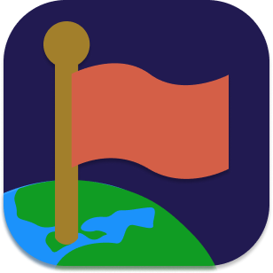
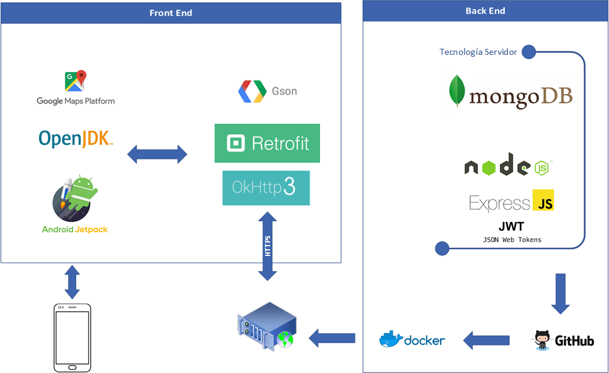
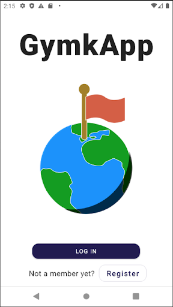
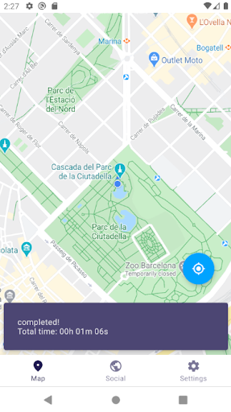

# GymkApp

L'aplicació definitiva per gimcanes

**Taula de continguts**

* [Introducció](#introducció)
* [Objectius](#objectius)
* [Métode](#métode)
  * [Estructura del sistema](#estructura-del-sistema)
  * [Tecnologies](#tecnologies)
* [Producte final](#producte-final)
* [Conclusions](#conclusions)

## Introducció

La present memòria recull per escrit la informació que fa referència al projecte de tecnologies de la informació que hem dut a terme: GymkApp. Es descriu el procés de planificació disseny i implementació del sistema, una aplicació Android per a construir i jugar gimcanes pel món. Les gimcanes o mapes són conjunts de punts, que consten a més d’una descripció general que ajuda a definir quin tipus de joc ens trobarem. Els punts consten d’una posició en el mapa i un petit text que ens dona una pista sobre on anar. Per a jugar una gimcana cal passar per totes els punts, el text dels quals es revela quan es supera l’anterior. L’aplicació està pensada per a permetre la creació de punts i mapes als usuaris i per a poder jugar qualsevol d’ells. Finalment el desenvolupament ha arribat a poder jugar-ne una sola precarregada al sistema.

## Objectius

Havent analitzat les necessitats que presenta el món de la gimcana, ens plantegem els següents objectius:

* Digitalitzar la gimcana
  * Pot ser jugada sense suport físic
  * Pot ser jugada telemàticament
  * Permetre un nombre elevat de jugadors
* Fer les gimcanes reutilitzables
  * Mantenir un registre de les gimcanes
  * Poder compartir les gimcanes amb altres persones
* Comprovar el compliment de proves

## Métode

En aquesta secció trobem necessari una introducció del model el qual es recolza l'api creada i el conjunt que s'utilitzen tant en el Back End com en el Front End.

### Estructura del sistema

En la figura podem veure les principals tecnologies que s'han implementat en el projecte i quina és la interacció entre elles

### Tecnologies

Aquestes són totes les tecnologies usades per al desenvolupament de la app.

* Node.js
* MongoDB
* Express
* JWT
* Docker
* Github
* UPCLink
* Android SDK
* Kotlin/JVM
* Android Jetpack
* Maps SDK
* Google Location Services
* Material Design
* Retrofit 2
* OkHTTP3
* Gson

## Producte final

Aparença final de l'aplicació.

 

## Conclusions

El resultat d'aquest projecte ha estat un sistema que integra diferents tecnologies tan vistes a classe com algunes que ens ha semblat interessants aplicar-les. En primer lloc, com s'ha pogut veure al llarg del treball s'han complert els principals objectius del projecte amb un resultat satisfactori: digitalitzar les gimcanes, fer-les i comprovar el compliment de les proves mitjançant la ubicació de l'usuari. Es tracta de modernitzar les gimcanes i això pot tenir un gran impacte en el temps actual on es busca l'entreteniment digital. En segon lloc, hem ampliat els nostres coneixements en tecnologies utilitzades en l'actualitat i que tenen un impacte important a l'hora de crear, desenvolupar i desplegar un projecte tecnològic. Tot i això, fins al moment de presentació d’aquesta memòria, la implementació per part del servidor ha aconseguit la seva completesa, però per part de l’aplicació s’ha arribat a jugar a un mapa prefixat, sense poder crear-lo ni seleccionar quin volem jugar.
